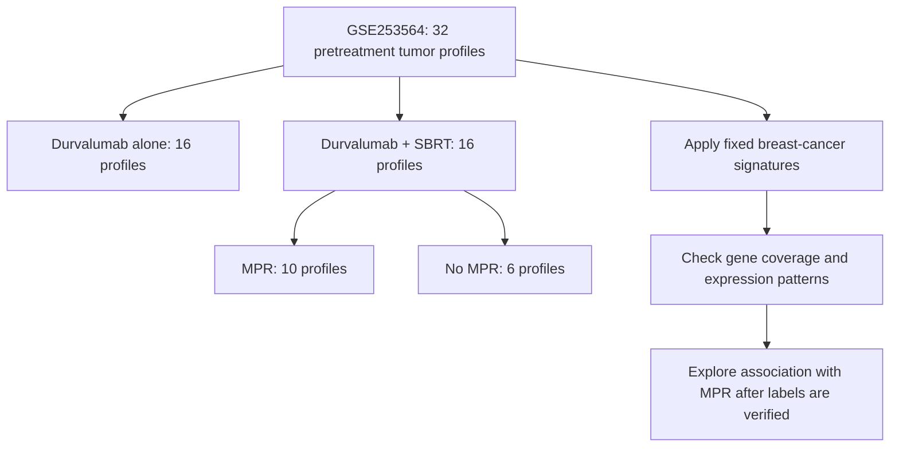

# Data visualization proof of concept

## The data in one picture

The target is pretreatment tumor RNA-seq from 32 patients with early-stage non-small cell lung cancer (NSCLC). The public GEO record provides an FPKM expression matrix. The published study reports 16 pretreatment profiles per treatment arm; among the 16 profiles from the combination arm, 10 achieved major pathologic response (MPR) and 6 did not.



The 10/6 split is a published cross-check for the cohort. The scripts do not infer or assign patient labels from those counts. Clinical arm and MPR labels must be linked to sample IDs from the study's cohort table and recorded in a verified `clinical.csv` first.

## What the plots show

Run `radio-transfer visualize` after downloading the expression matrix. It writes high-resolution PNG figures, a JSON summary, and `visualization_notes.md` into an output folder.

| Figure | What it represents | How it may help the project |
| --- | --- | --- |
| `sample_expression_distributions.png` | Per-sample distributions after `log2(FPKM + 1)` | Quickly shows whether samples have broadly different expression ranges or unusual distributions. It is an exploratory view, not a full sequencing QC report. |
| `expression_pca.png` | Two-dimensional summary of the 500 most variable genes, after log transform and per-gene scaling | Shows broad similarities, differences, and possible outliers among tumors. PCA does not use MPR labels. |
| `signature_gene_coverage.png` | Exact gene-symbol matches for the 34-gene radiosensitivity signature (RSS) and 4-gene immune signature | Identifies whether the published signatures can be scored against this matrix. Unmatched identifiers must be reconciled from source records; the code does not guess aliases or substitute genes. |
| `signature_coefficients.png` | The fixed published coefficient for each signature gene | Makes the score calculation easier to explain. These bars are source weights, not patient measurements. |
| `signature_expression_heatmap.png` | Per-gene standardized expression for the signature genes across all baseline samples | Shows whether signature genes vary across tumors and whether the two fixed signatures have visible expression patterns. It is not an outcome-trained clustering. |
| `signature_scores_by_mpr.png` | Oriented signature scores for verified MPR and non-MPR samples in the durvalumab + SBRT arm | Provides the first exploratory response-group comparison. It appears only after complete, verified outcome labels and complete signature genes are available. No clinical cutoff is applied. |

If no clinical metadata is supplied, the script still generates expression, coverage, coefficient, and heatmap views. It does not guess a treatment arm or response from sample names. If any required signature symbol is absent or constant, the score/heatmap view is skipped and the coverage file explains the issue.

## What this can tell the professor

The proof of concept demonstrates the shape of the available RNA-seq data, checks whether the two published breast-cancer signatures can be transferred to the NSCLC matrix, and shows how a fixed score could be compared with MPR after source-verified labels are linked. A consistent score direction would motivate a larger external validation study; a weak or unstable pattern would also be useful evidence about limits to cross-cancer or cross-platform transfer.

This small cohort cannot establish individual prediction, prove that radiation caused a response, or support treatment decisions. A response-score plot is descriptive and hypothesis-generating. The current scoring uses log2(FPKM + 1) followed by per-gene z-scores across the baseline cohort as an explicit RNA-seq adaptation; it is not a claim that the original breast-cancer preprocessing has been reproduced exactly. The original breast-specific cutoffs are not used.

## Reproduce

```bash
python -m venv .venv
source .venv/bin/activate
pip install -e .
radio-transfer download --output data/raw
radio-transfer visualize \
  --expression data/raw/GSE253564_Pre-treatment_Samples_Pubs_FPKMs.txt.gz \
  --signatures config/rss.json config/immune.json \
  --output results/visualization_poc
```

To add the response comparison, first complete and verify the sample-to-patient, treatment-arm, baseline, and MPR mapping in a CSV that follows `config/metadata_template.csv`, including the source for each label. Then add `--metadata data/clinical.csv`. The metadata loader excludes unverified labels and stops on duplicate eligible patients.

The current PR does not contain the downloaded GEO matrix or a verified clinical linkage, so it contains no fabricated patient-level plots or outcome results. Run the command after those inputs are available; the figures are written locally under the selected results directory.

## Sources

- NCBI Gene Expression Omnibus, [GSE253564](https://www.ncbi.nlm.nih.gov/geo/query/acc.cgi?acc=GSE253564): study description, sample count, and pretreatment FPKM matrix.
- Altorki NK et al. [A signature of enhanced proliferation associated with response and survival to anti-PD-L1 therapy in early-stage non-small cell lung cancer](https://pmc.ncbi.nlm.nih.gov/articles/PMC10982989/). *Cell Reports Medicine*, 2024. The article describes the 10 MPR / 6 non-MPR split among the 16 available pretreatment combination-arm tumors.
- Cui Y et al. [A signature of radiation resistance in breast cancer identifies patients who may benefit from radiotherapy](https://doi.org/10.1158/1078-0432.CCR-18-0825). *Clinical Cancer Research*, 2018. Source of the fixed RSS and immune signature specifications recorded in `config/`.
